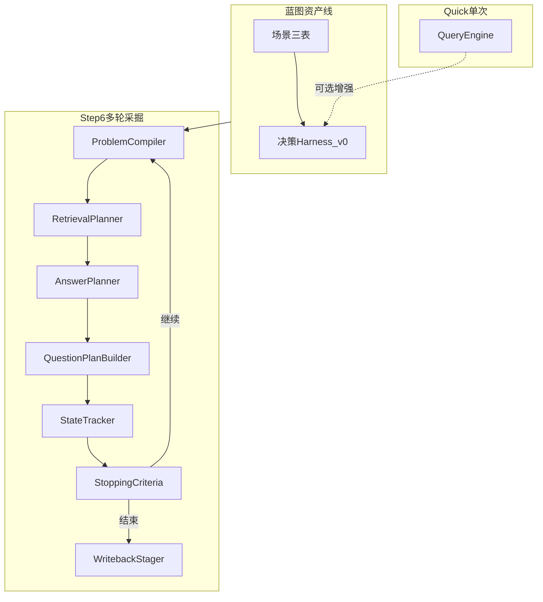

# 专家经验 → 本体大脑：升级方案（含 Step6 细化）

## 三条主线如何叠在一起

| 主线 | 文档 | 解决什么问题 |
|------|------|----------------|
| 资产生产线 | [expert_experience_to_ontology_brain_harness_blueprint.md](docs/expert_experience_to_ontology_brain_harness_blueprint.md) | 经验 → 表结构 → Harness → Eval 回流 |
| 分层架构 | [architecture.md](docs/architecture.md) | raw / wiki / ontology+memory / Hermes / evolution 边界 |
| 交互式采掘 | [Step6.md](docs/Step6.md) | 从「被动单次 QA」→ **多轮追问、显式槽位、可停判、分层写回**；Hermes 只做编排 |

Step6 **不替代**蓝图里的「三张表」，而是 **在表与 wiki 之上增加一条多轮运行时**：ProblemCompiler 消费 **场景 slot schema + 已知/缺失槽**；RetrievalPlanner 按四桶补证据；QuestionPlanBuilder 产出 **可审查的下一问计划**；停判满足后 WritebackStager 做 **分层写回（仍提案优先）**。

---

## 现状锚点（与蓝图的差距）

当前主链路仍是 **[B] wiki 为主** 的离线编译物 + **[D] 雏形]** 的固定流水线（[`QueryEngine`](src/personal_brain/retrieval/query_engine.py)），工作台以单轮展示为主（[brain-workbench](brain-workbench/)）。

蓝图缺口：**结构化本体表 + 决策表 + Eval/bad case 闭环**。Step6 缺口：**多轮状态机、显式 QuestionPlan、四桶检索、分层写回、前端双模式**。二者合并后：表驱动 **喂饱** ProblemCompiler；多轮 **执行** 采掘与停判；Eval **接** 会话出口。

---

## 升级原则（与 AGENTS.md / architecture / Step6 对齐）

- **分层不混**：`raw/` 语义不改写；写回保持 **proposal / 评审**（Step6 三层写回亦同）。
- **单场景试点**：先 `scene_id` + slot schema，再扩场景。
- **领域逻辑不出库**：Step6 写明 Hermes **仅编排**；`src/personal_brain/extraction/` 持有编译器、规划器、状态机（与 Step6「Add new modules」一致）。
- **追问不裸奔**：必须先 [`QuestionPlan`](docs/Step6.md)（类型、候选问、目标缺槽、`stop_if`），再展示给用户。

---

## 阶段 0：对齐资产形态（1–2 周）

（与前一版相同，**增加**每条场景需定义 **slot schema**，供 Step6 ProblemCompiler 使用。）

| 产出 | 落点 | 说明 |
|------|------|------|
| 本体 + 决策 + flow 节点 | `ontology/scenes/<scene_id>/` | 蓝图三表 |
| **Slot schema**（可选字段、必填、类型） | 同目录 `slots.json` 或与对象表合并 | Step6 已知/缺失槽的契约 |
| 评测 / bad case | [`eval/`](eval/) 扩展 | 与 Workbench 报告对齐 |

**验收**：SceneLoader 只读加载；**ProblemCompiler 能对单场景输入产出合法的部分槽位状态**（单测）。

---

## 阶段 1：单场景「四件套」+ slot 契约（2–4 周）

蓝图四件套 + **为 Step6 写清「当前知识目标」与槽位字典**（可与 wiki 中 SOP 章节交叉引用）。

**验收**：流程图节点 ID ↔ 对象/状态；**每条决策可映射到至少一个 missing_slot 的补齐路径**（便于 QuestionPlan 的 `target_missing_slots`）。

---

## 阶段 2a：Harness v0（表驱动单次增强）（4–6 周）

保留「单次 Quick」路径，接入 **SceneContextCompiler + DecisionHarness v0**（与前一版一致），为 Extraction 模式提供 **同一套表** 的只读决策匹配结果。

**验收**：`POST /api/ask`（或并行字段）可返回 `matched_decisions` + 规则校验摘要。

---

## 阶段 2b：Step6 Extraction 核心包（6–10 周，可与 2a 交错）

按 [Step6.md](docs/Step6.md) 新增包（建议路径）：

| 模块 | 职责 |
|------|------|
| [`problem_compiler.py`](src/personal_brain/extraction/problem_compiler.py) | 当前对象、知识目标、问题类型、已知/缺槽、**下一步动作**：答 / 追问 / 再检索 / 建议写回 |
| [`retrieval_planner.py`](src/personal_brain/extraction/retrieval_planner.py) | 四桶：`object_pages`、`evidence_pages`、`conversation_hits`、`pattern_hits`（后两桶可先占位实现） |
| [`question_plan_builder.py`](src/personal_brain/extraction/question_plan_builder.py) | 产出 **QuestionPlan**（禁止先自由生成自然语言问句） |
| [`state_tracker.py`](src/personal_brain/extraction/state_tracker.py) | 多轮累积、序列化、与 `memory/session` 边界一致（AGENTS §18.2） |
| [`stopping_criteria.py`](src/personal_brain/extraction/stopping_criteria.py) | 停判（槽满、信息增益低于阈值、用户显式结束、达最大轮次等） |
| [`writeback_stager.py`](src/personal_brain/extraction/writeback_stager.py) | **分层**：session-level / knowledge-level / asset-level；**均经提案与审批边界**，对接现有 Writeback 管线而非新写生产 ontology |

**与 QueryEngine 关系**：Quick 可继续调用现有 `QueryEngine.ask`；Extraction 在停判前 **循环**「compiler → retrieval planner → answer planner（可复用现有 planner/composer 子组件）→ question plan → 用户回合」，最后一轮触发 `writeback_stager` 生成 **多层提案**。

**验收**：Step6 Success criteria 缩小版——**≥3 轮**人工可走通；每轮 UI/API 可 inspect QuestionPlan 与 StateTracker 快照；结束时有 **分层写回预览**（不必全部已应用）。

---

## 阶段 3：API 与会话持久化

- 新路由示例：`POST /api/extraction/sessions`（创建）、`POST /api/extraction/sessions/:id/turn`（提交用户答或选择下一问）、`GET /api/extraction/sessions/:id`（当前状态）。  
- 契约：请求/响应包含 Step6 所列显式字段（object、goal、slots、候选问、projected writeback level）。  
- 测试：`tests/unit` 覆盖停判、空槽、非法转移。

---

## 阶段 4：工作台（Step6 前端）

在 [brain-workbench](brain-workbench/)「问题分析」增加：

- **Quick Answer**：当前单轮行为（Step5 真数据不变）。  
- **Extraction Interview**：展示 Step6 所列面板（当前对象、知识目标、已知/缺槽、当前答、下一问候选、**预计写回层级**）。

**验收**：双模式可切换；Extraction 下无后端时错误态明确（与 Step5 一致）。

---

## 阶段 5：Hermes 集成（编排层）

- Hermes / `hermes-agent-main`：**只接** Personal Brain 已暴露的 HTTP tools 或未来 adapter tools（`search_wiki`、`read_page`、extraction turn 等）。  
- **禁止**：把 ProblemCompiler、四桶检索规则、写回策略写进 Hermes 内部 prompt 大杂烩（Step6 原文要求）。  
- 文档：在 `docs/` 或 adapter README 中固定 **「编排 ↔ 领域」** 列表与 TODO（AGENTS §18.7）。

---

## 阶段 6：Eval 闭环（与蓝图 §7 + Step6 出口）

- Extraction 会话 `session_id` 作为 eval case 外键；字段对齐蓝图（完备性、证据、决策质量）+ Step6（轮次、停因、最终 slot 覆盖率）。  
- bad case 回流仍 **人审** 后进 wiki / decisions。

---

## 风险与刻意不做的事

- **表未稳 + 多轮 LLM**：先固定 **QuestionPlan 模板与候选池**（可由表生成），减少自由生成。  
- **不做**：在线自改核心、自动 promote 生产 skill、静默跨层写 raw/wiki。

---

## 建议优先级（合并后的一句话）

**先做场景三表 + slot 契约（喂 ProblemCompiler）→ 并行落地 Extraction 包与会话 API → Quick 路径挂 Harness v0 → 工作台双模式 → Hermes 仅编排接线 → Eval 接会话出口。**

这样同时满足：蓝图「可编译资产」、architecture「分层」、Step6「可渐进采掘与可检视追问计划」。
