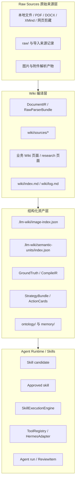
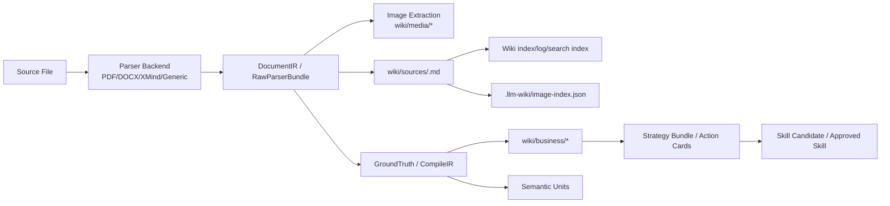
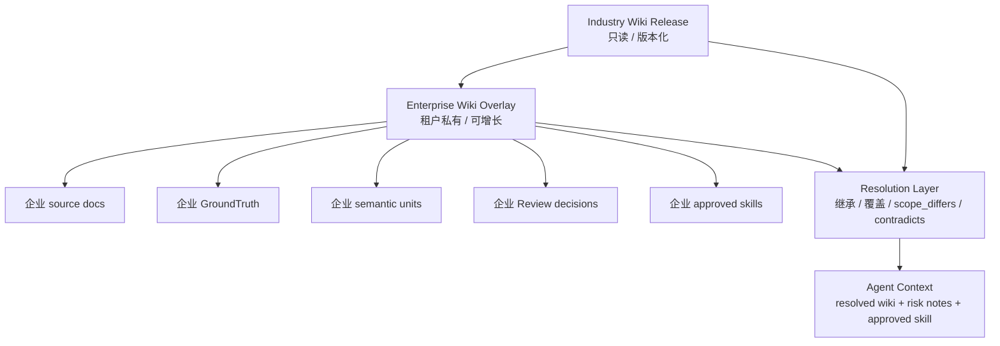
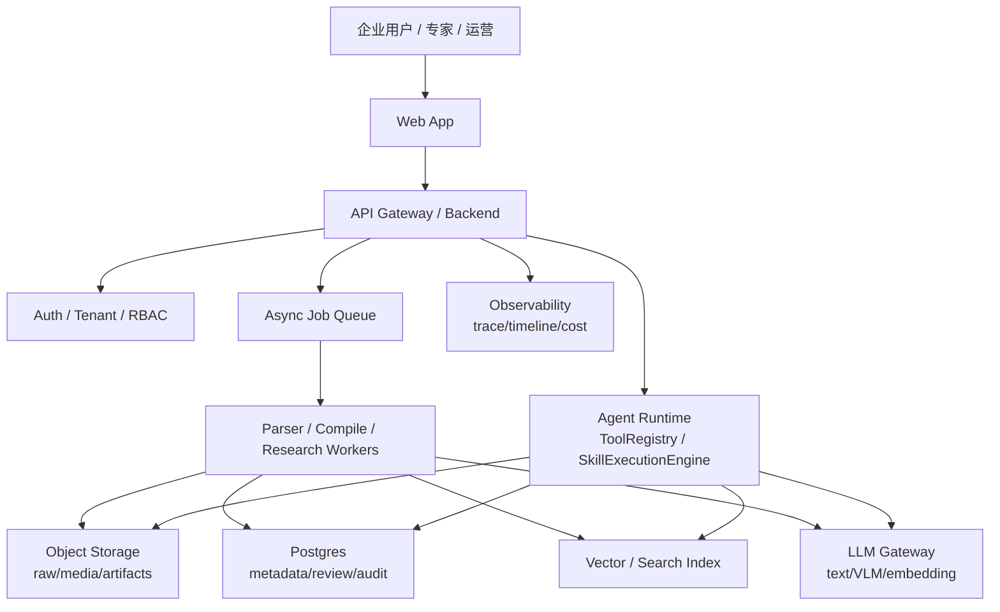
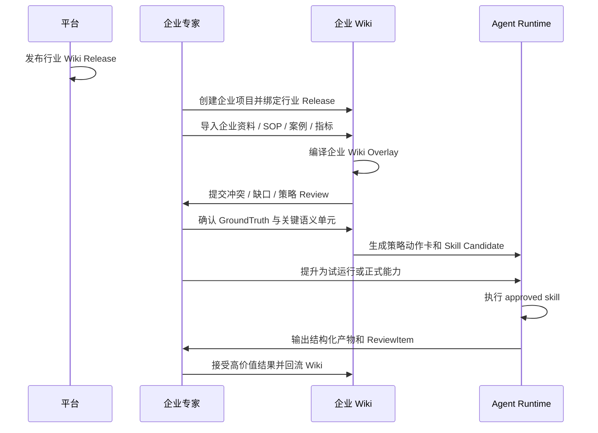

# 行业 Wiki / 企业 Wiki / Agent 消费链路技术报告

> 面向线上正式版本前的工程内参与企业方案底稿。
>
> 本报告基于当前仓库实现梳理，不引用具体业务数据、客户文档正文、密钥、缓存或运行日志。

## 1. 执行摘要

当前系统的核心价值不是“把文档塞进向量库后做问答”，而是把行业知识和企业知识编译成可持续增长的 Wiki，并在 Wiki 之上沉淀结构化资产、策略包、业务能力和 Agent 执行链路。

系统已经形成四层能力：

| 层级 | 当前资产 | 主要价值 |
| --- | --- | --- |
| Raw Sources | `raw/`、桌面端导入文件、PDF/DOCX/图片解析产物 | 保留来源、校验 checksum、维持事实底座 |
| Curated Wiki | `wiki/`、`wiki/sources/`、业务页、研究页 | 人可读、可检索、可维护的主知识层 |
| Ontology / Memory | `ontology/`、`memory/`、`.llm-wiki/*` 索引与候选资产 | 把 Wiki 派生为机器可消费资产 |
| Agent Runtime / Skills | `skills/`、策略包、approved skill、ToolRegistry/Hermes adapter | 让 Agent 读取知识、执行能力、生成可审阅产物 |

面向企业正式版本，可以把这套能力升级为两层 Wiki 加一条消费链路：

1. 行业 Wiki 层：平台侧预编译行业知识、行业 SOP、行业指标口径、行业策略模板和评测集。
2. 企业 Wiki 层：企业在行业底座上叠加自己的商品、人群、组织、流程、约束、历史案例和经营动作。
3. Wiki 到 Agent 消费链路：Agent 不直接消费 raw-only 内容，而是优先消费 Wiki、语义单元、策略包、approved skill 和执行产物。

这会让企业端从“一次性知识库问答”升级为“持续成长的经营知识系统”。行业 Wiki 提供起点和默认方法，企业 Wiki 负责个性化经营环境，Agent 负责把 Wiki 变成可运行、可审阅、可回流的动作。

## 2. 产品技术愿景

### 2.1 两层 Wiki 的产品定义

行业 Wiki 是平台提供的“行业经营知识底座”。它来自行业文档、标准 SOP、公开研究、专家经验、典型案例和行业指标定义，输出为版本化、可审计、可评测的 Wiki Release。

企业 Wiki 是租户私有的“企业经营知识生长层”。它吸收企业自己的商品资料、品牌策略、用户反馈、运营 SOP、历史实验、视觉素材、业务指标和专家修订。企业 Wiki 不复制行业 Wiki，而是在行业 Wiki 之上形成 overlay：继承行业默认知识，覆盖企业特有规则，保留差异和冲突。

Agent 消费链路是把 Wiki 转换成可执行能力的运行层。Agent 通过检索、读取、策略包、Skill contract 和执行引擎，把知识转化为诊断、素材 brief、实验计划、优化动作和审阅任务。

### 2.2 为什么不是普通 RAG

普通 RAG 的主要模式是“每次问题临时检索，再临时生成答案”。它的优势是轻量，但缺点是知识不容易稳定沉淀，冲突不容易治理，企业方法无法复用，Agent 执行也缺少可审计合同。

当前系统走的是 Wiki-first 路线：

| 维度 | 普通 RAG | 当前系统目标 |
| --- | --- | --- |
| 知识形态 | 文档切片和向量 | 人可读 Wiki + 结构化索引 |
| 更新机制 | 重新切片/重建索引 | 增量 ingest、Review、Writeback、SemanticUnit |
| 可追溯性 | chunk 引用 | source refs、evidence refs、wiki refs、action card refs |
| 企业适配 | prompt 定制 | 行业 Wiki + 企业 overlay + Skill 能力包 |
| Agent 消费 | 临时上下文 | approved skill + schema + execution plan |
| 治理 | 弱 | 冲突 Review、人审、版本化、审计 |

## 3. 当前实现架构

### 3.1 系统分层架构图



### 3.2 当前运行面

当前仓库主要有两个运行面：

| 运行面 | 位置 | 作用 |
| --- | --- | --- |
| 桌面端业务工作台 | `open_llm_wiki/` | Tauri + React，负责项目管理、文档导入、Wiki 浏览、问答、研究、策略和技能运行体验 |
| Personal Brain Python 层 | `src/personal_brain/` | 提供 ingestion、wiki compiler、retrieval、writeback、ontology、skills、ToolRegistry 和 Hermes adapter |

桌面端本身也包含大量 TypeScript 侧知识编译逻辑，例如 `open_llm_wiki/src/lib/ingest.ts`、`scene-compile.ts`、`strategy-compile.ts`、`semantic-units.ts`、`knowledge-image-index.ts` 和 `research-task-runner.ts`。Python 层则更接近未来 Agent Runtime 和后端服务化边界，核心契约集中在 `src/personal_brain/models/core.py`。

### 3.3 前端工作台模块

`open_llm_wiki/src/components/layout/content-area.tsx` 把主工作台拆成以下视图：

| 视图 | 模块 | 当前能力 |
| --- | --- | --- |
| 普通知识问答 | `components/chat` | 基于 Wiki 检索、图片证据卡、会话历史、SSE 文字回答 |
| 业务修订/解析工作台 | `components/agent-mode` | 文档解析、GroundTruth、修订卡和发布门禁 |
| 策略工作台 | `components/strategy` | 策略包、动作卡、Skill 候选、approved skill、智能执行助手 |
| 深度研究 | `components/research` | ResearchTaskRunner、商机/市场分析、机会卡片矩阵 |
| Review | `components/review` | 人审入口，承接异步 Review、研究 findings、策略/语义冲突 |
| Graph/Search/Lint | `components/graph`、`search`、`lint` | 知识图谱、检索、健康检查 |
| Settings/Sources | `components/settings`、`sources` | 模型、搜索、VLM、文档来源和维护操作 |

### 3.4 Tauri 命令层

Tauri 层是桌面端访问本地文件系统、解析器和 Python runtime 的桥：

| 命令模块 | 作用 |
| --- | --- |
| `src-tauri/src/commands/fs.rs` | 文件读写、目录列表、base64 读取、DOCX/XLSX 等本地能力 |
| `src-tauri/src/commands/pdf_backend.rs` | PDF 解析后端状态和解析能力 |
| `src-tauri/src/commands/document_backend.rs` | DOC/DOCX/XMind 等文档后端 |
| `src-tauri/src/commands/extract_images.rs` | PDF/DOCX 图片抽取、图片资产落盘 |
| `src-tauri/src/commands/vectorstore.rs` | LanceDB/vector search upsert/search/delete/count |
| `src-tauri/src/commands/personal_brain.rs` | Python Personal Brain 调用桥，包括策略 Skill 生成、审批和 Agent run |

### 3.5 Python Personal Brain 层

Python 层已经具备后端化雏形：

| 模块 | 当前职责 |
| --- | --- |
| `ingestion/service.py` | 原始来源入库、checksum、SourceRecord、文件分组 |
| `wiki/compiler.py` | SourceRecord 到 WikiPage 的编译、index/log 写入、schema-driven pages |
| `retrieval/query_engine.py` | Wiki 检索、page ranking、evidence selection、AnswerRecord |
| `writeback/*` | 写回路由、质量门禁、merge-safe 更新 |
| `ontology/*` | ontology candidate 提取、canonicalize、evidence linkage |
| `skills/strategy_runtime.py` | 策略 Skill 候选、approved skill、SkillExecutionEngine、Agent run |
| `agent/tool_registry.py` | search_wiki/read_page/search_memory/propose_writeback/run_lint/approved_skill 工具注册 |
| `agent/hermes_adapter.py` | 未来 Hermes runtime 的工具边界 |

## 4. 文档解析与 Wiki 编译链路

### 4.1 文档解析到 Wiki 编译数据流



### 4.2 当前实现

桌面端 TypeScript 侧定义了 `DocumentIR`、`DocumentBlock`、`RawParserBundle`、`RawParserImage`、`DecisionPoint` 等结构，位置在 `open_llm_wiki/src/lib/agent-mode-types.ts`。这些结构用于把非结构化文档变成可定位、可引用、可编译的中间表示。

文档解析和 Wiki 写入的关键模块包括：

| 能力 | 模块 | 说明 |
| --- | --- | --- |
| ingest 主链路 | `open_llm_wiki/src/lib/ingest.ts` | 两阶段分析/生成、FILE block 解析、安全写入、review block 解析 |
| ingest cache | `open_llm_wiki/src/lib/ingest-cache.ts` | 基于 SHA256 跳过未变化来源 |
| ingest queue | `open_llm_wiki/src/lib/ingest-queue.ts` | 持久化队列、恢复、取消、重试 |
| DocumentIR | `open_llm_wiki/src/lib/document-ir.ts` | 解析块转中间表示 |
| scene compile | `open_llm_wiki/src/lib/scene-compile.ts` | 根据场景包生成业务页、GroundTruth/CompileIR 投影 |
| strategy compile | `open_llm_wiki/src/lib/strategy-compile.ts` | 从 schema/wiki/ground truth 编译动作卡和策略包 |
| image index | `open_llm_wiki/src/lib/knowledge-image-index.ts` | 图片一等索引、caption、检索、补齐状态 |
| semantic units | `open_llm_wiki/src/lib/semantic-units.ts` | 语义单元、关系、冲突 Review |

### 4.3 图片证据链路

图片不应只是 Markdown 附件，而应作为证据资产进入检索和问答。当前实现已经把图片索引提升为一等资产：

| 资产 | 说明 |
| --- | --- |
| `wiki/media/<source-slug>/img-*.png` | 从原始文档抽取的图片文件 |
| `wiki/sources/<slug>.md` | 原始 source 页中的图片 Markdown 引用 |
| `.llm-wiki/image-index.json` | 图片索引，包含 imageId、relPath、caption、fallbackCaption、nearbyText、headingPath、tags、status |
| `.llm-wiki/image-caption-cache.json` | caption 缓存，避免重复 VLM 调用 |
| `.llm-wiki/image-caption-backfill-state.json` | 项目级 caption 补齐状态，保证补齐不是每次重复执行 |

问答阶段应该优先从 image index 命中图片证据，图片证据卡独立展示，不依赖模型主动输出 Markdown 图片。Caption 属于证据索引层，不自动写入 GroundTruth 或业务结论。

### 4.4 语义单元与冲突处理

`open_llm_wiki/src/lib/semantic-units.ts` 定义了语义单元工作索引：

| 类型 | 说明 |
| --- | --- |
| `SemanticUnit` | claim、rule、decision_point、metric_definition、action_recommendation、exception、evidence_case |
| `SemanticRelation` | supports、duplicates、refines、contradicts、supersedes、scope_differs |
| `SemanticConflictReviewPayload` | 冲突 Review payload，记录双方 unit、摘要和建议裁决 |

这为行业/企业双层 Wiki 很关键：当企业知识与行业知识不同，系统不应该简单覆盖，也不应该把冲突抹平，而应该建立关系并进入 Review。未裁决冲突不能默认进入 GroundTruth、策略包、Skill 或 Agent 自动运行链路。

## 5. 知识库更新与成长机制

### 5.1 当前更新机制

当前系统已经具备多种知识成长入口：

| 入口 | 资产流向 | 作用 |
| --- | --- | --- |
| 文件导入/重解析 | raw/source -> wiki/source -> indexes | 将新知识编译进 Wiki |
| 普通知识问答 | search/wiki/image evidence -> AnswerRecord/chat | 基于 Wiki 回答，并保留回答记录 |
| Review / Sweep | review item -> accepted/dismissed | 人审治理 LLM 建议和冲突 |
| Writeback | answer/research finding -> proposal -> wiki managed section | 把高价值答案沉淀回 Wiki |
| Deep Research | web sources -> research session -> finding/opportunity card | 补充外部市场/商机证据 |
| Strategy Compile | GroundTruth/wiki/business -> action cards | 将知识转为业务动作 |
| Skill Promotion | action card -> candidate skill -> approved skill | 将重复动作沉淀为 Agent 能力 |
| Agent Run | approved skill -> run artifact -> optional ReviewItem | 执行业务能力并产生可审阅产物 |

### 5.2 写回与治理边界

仓库规则明确要求分层治理：

| 层 | 写入原则 |
| --- | --- |
| `raw/` | append-only，保留 provenance，不被总结覆盖 |
| `wiki/` | 人可读优先，重要事实要有 source refs，避免 raw dump |
| `.llm-wiki/` | 工作索引、会话、策略、图片、研究状态，允许重建和刷新 |
| `ontology/` / `memory/` | 只接收稳定、可复用、可追溯的派生资产 |
| `skills/` | 候选与 approved skill 分离，升级需要人工确认 |

线上正式版应把这些边界产品化：每个写入动作都要有来源、目标、审批状态、可回滚记录和审计日志。

## 6. 行业 Wiki 层设计

### 6.1 行业 Wiki Release 的目标形态

行业 Wiki 应是平台侧发布的版本化知识底座。它不是一批 loose 文档，而是经过治理的知识包：

| 组件 | 说明 |
| --- | --- |
| 行业 raw corpus | 行业标准文档、公开资料、专家 SOP、案例材料 |
| 行业 Wiki | 主题页、流程页、指标页、案例页、策略页 |
| 行业 schema/profile | 场景字段、评估规则、策略动作卡合同 |
| 行业 semantic units | 稳定规则、指标口径、动作建议、案例证据 |
| 行业 strategy profiles | 通用策略卡类型、动作卡模板、Skill family |
| 行业 eval cases | 用于检查解析、问答、策略、Skill 输出质量 |
| Release manifest | 版本号、适用行业、适用场景、变更日志、兼容约束 |

建议未来定义最小接口：

```ts
interface IndustryWikiRelease {
  releaseId: string
  industryId: string
  version: string
  wikiRoot: string
  schemaProfiles: string[]
  strategyProfiles: string[]
  semanticUnitIndex: string
  evaluationCases: string[]
  createdAt: string
  changelog: string
}
```

### 6.2 行业 Wiki 的治理要求

行业层应满足四个条件：

1. 可版本化：企业项目绑定某个行业 release，不被平台后台静默改写。
2. 可解释：每个规则、指标、策略动作都有 evidence refs。
3. 可评测：发布前跑行业 eval cases，检查问答、策略、Skill 输出稳定性。
4. 可继承：企业层可以引用、覆盖或标记不适用，但不直接改写行业 release。

### 6.3 当前实现可复用部分

当前仓库已有很多行业层雏形：

| 当前实现 | 可演进为 |
| --- | --- |
| `scene-pack.ts` | 行业场景包与企业场景初始化模板 |
| `schemaProfile / strategyProfile` | 行业 schema/profile 版本包 |
| `semantic-units.ts` | 行业语义单元索引与冲突检测 |
| `strategy-compile.ts` | 行业策略动作卡编译器 |
| `research-profiles.ts` | 行业研究任务 profile |
| `eval/*`、`tests/*` | 行业 release 验收与回归测试 |

## 7. 企业 Wiki 层设计

### 7.1 企业 Wiki Overlay 关系图



### 7.2 企业 Wiki 的核心能力

企业 Wiki 是行业底座的私有增长层，应覆盖：

| 能力 | 说明 |
| --- | --- |
| 企业知识导入 | 商品、品牌、组织、SOP、案例、指标、素材、历史实验 |
| 企业环境建模 | 当前平台、渠道、人群、价格带、供应链、运营节奏 |
| 企业 GroundTruth | 对某个文档/场景的确认事实和业务判断 |
| 企业 semantic units | 与行业规则相同、补充、细化、冲突或适用范围不同的语义单元 |
| 企业策略包 | 基于企业 Wiki 和行业 profile 生成的动作卡 |
| 企业 Skill | 从企业 confirmed action cards 提升为试运行/正式能力 |
| 企业 Review | 冲突裁决、策略确认、Skill promotion、Agent run 审阅 |

建议未来定义最小接口：

```ts
interface EnterpriseWikiOverlay {
  tenantId: string
  projectId: string
  baseIndustryReleaseId: string
  wikiRoot: string
  overlaySemanticUnitIndex: string
  resolutionPolicy: "industry_default" | "enterprise_override" | "manual_review_required"
  approvedSkillRoot: string
  reviewQueueId: string
}
```

### 7.3 行业知识与企业知识的冲突策略

企业知识可能与行业底座冲突，尤其是指标阈值、素材规范、人群理解、动作优先级和组织流程。推荐默认策略：

| 关系 | 处理方式 |
| --- | --- |
| supports / duplicates | 合并证据，提升置信度 |
| refines | 企业层细化行业默认规则，保留行业来源 |
| scope_differs | 在回答和策略里明确适用范围，不判定为真冲突 |
| contradicts | 进入人工 Review，未裁决前不得进入默认 Agent 执行 |
| supersedes | 需要版本/时间/权威性证据，不能仅靠新文档覆盖旧文档 |

## 8. Wiki 到 Agent 的消费链路

### 8.1 Agent 消费链路图

```mermaid
flowchart LR
  Q["用户任务 / 经营问题"] --> R["Wiki Retrieval<br/>search_wiki / read_page / image evidence"]
  R --> S["Strategy Bundle<br/>strategyCards + actionCards"]
  S --> C["Skill Candidate<br/>SKILL.md + schemas + metadata"]
  C --> A["Approved Skill<br/>试运行 / 正式启用"]
  A --> E["SkillExecutionEngine"]
  E --> P["Execution Plan<br/>single_plan_local_execute"]
  P --> X["Local Step Execution<br/>read_file / data_extract / data_transform / human_review"]
  X --> O["Structured Output<br/>诊断 / 建议 / 产出物 / 验证计划"]
  O --> V["Validation / ReviewItem"]
```



### 8.2 当前 Skill 包合同

Python 层 `StrategySkillCandidateManifest` 和 `ApprovedSkillSpec` 已经定义了 Skill 候选和 approved skill 的核心字段：

| 资产 | 字段/文件 |
| --- | --- |
| Candidate manifest | skill_id、title、summary、scene_id、origin_action_card_ids、required_inputs、output_artifact、action_steps、schema_version |
| Skill 包 | `SKILL.md`、`input_schema.json`、`output_schema.json`、`metadata.json`、`execution.json`、`examples/` |
| Approved skill | skill_id、title、scene_id、tier、family、path、wiki_refs、source_refs、input_schema、output_schema、execution_spec |
| Agent run | run_id、status、executed_skills、structured_output、validation_errors、execution_timeline、step_executions、execution_plan、output_artifacts |

### 8.3 SkillExecutionEngine 当前能力

`src/personal_brain/skills/strategy_runtime.py` 中的 `SkillExecutionEngine` 已从模板报告升级为更真实的执行引擎：

| 阶段 | 当前行为 |
| --- | --- |
| load_skill | 读取 approved skill 包、metadata、execution.json、SKILL.md |
| validate_input | 按 input_schema 检查必填输入，缺失则 `needs_input` |
| load_context | 读取 wiki refs、strategy bundle、GroundTruth、draft、action cards |
| plan_execution | 默认 `single_plan_local_execute`，一次 LLM 生成执行计划 |
| local step execution | 本地执行 read_file、local_tool、data_extract、data_transform、human_review 等步骤 |
| synthesize_final | 基于计划和步骤产物合成最终业务结构化输出 |
| validate_output | 按 output_schema 校验输出，失败则 `validation_failed` |
| save artifacts | 写入 `memory/skills/runs/<run-id>.json/.md` |

当前执行模式包括：

| executionMode | 定位 |
| --- | --- |
| `single_plan_local_execute` | 默认快速模式：一次理解，后续本地步骤拆解 |
| `llm_structured` | 逐步模型执行，适合调试或高精度场景，但耗时较长 |
| `template` | 降级兜底，不作为主体验 |

### 8.4 ToolRegistry 与 Hermes 适配

`ToolRegistry` 暴露稳定工具：

| 工具 | 作用 |
| --- | --- |
| `search_wiki` | 搜索 Wiki 页面 |
| `read_page` | 读取 Wiki 页面 |
| `search_memory` | 搜索 session/persistent memory |
| `propose_writeback` | 创建写回提案 |
| `run_lint` | 运行 Wiki 健康检查 |
| `start/continue/finish_extraction_interview` | 多轮萃取访谈 |
| `approved_skill::<skillId>` | 执行已启用业务能力 |

`HermesAdapter` 当前是轻量包装层，未来可以作为线上 Agent Runtime 的兼容边界。关键原则是：Hermes 只调用工具契约，不把检索、写回、Skill 执行核心逻辑硬编码进 Hermes 适配层。

### 8.5 建议的统一证据引用接口

线上版需要统一 raw/wiki/image/semantic/action/skill 的证据引用：

```ts
interface KnowledgeEvidenceRef {
  refId: string
  tenantId?: string
  projectId: string
  layer: "raw" | "wiki" | "image" | "semantic_unit" | "strategy_action" | "skill_run"
  path?: string
  sourceId?: string
  pageId?: string
  imageId?: string
  semanticUnitId?: string
  actionCardId?: string
  runId?: string
  quoteOrSummary: string
  confidence: number
  status: "candidate" | "confirmed" | "rejected" | "superseded"
}
```

建议的 Agent run 接口：

```ts
interface AgentSkillRun {
  runId: string
  tenantId: string
  projectId: string
  skillId: string
  executionMode: "single_plan_local_execute" | "llm_structured" | "template"
  taskInput: Record<string, unknown>
  contextRefs: KnowledgeEvidenceRef[]
  stepExecutions: Array<Record<string, unknown>>
  structuredOutput: Record<string, unknown>
  validationStatus: "completed" | "needs_input" | "degraded" | "validation_failed"
  reviewState: "not_required" | "pending" | "accepted" | "rejected"
  createdAt: string
}
```

## 9. Deep Research 与市场/商机分析能力

### 9.1 当前实现

`open_llm_wiki/src/lib/research-task-runner.ts` 把深度研究封装为通用 runner：

```ts
ResearchTaskRequest -> ResearchTaskRunner -> ResearchSession -> ResearchTaskResult
```

`research-types.ts` 已经定义：

| 类型 | 说明 |
| --- | --- |
| `ResearchTaskType` | `generic_research` / `market_opportunity_analysis` |
| `ResearchTaskRequest` | topic、businessContext、targetMarket、targetAudience、constraints、breadth、depth |
| `ResearchSession` | sources、learnings、thread、reportMarkdown、findings、opportunityCards |
| `OpportunityCard` | targetSegment、painPoint、opportunityHypothesis、evidenceSummary、risks、validationExperiments |

### 9.2 与行业/企业 Wiki 的关系

Deep Research 不应直接污染 GroundTruth 或企业 Wiki。它应该是候选证据入口：

1. 行业层：补充行业趋势、竞品信号、公开案例和通用机会假设。
2. 企业层：围绕企业当前问题形成机会卡和验证实验。
3. Review 层：由人确认哪些 research findings 可以进入 Wiki、策略候选或 ReviewItem。
4. Agent 层：只有 confirmed research finding 或 promoted opportunity card 才能进入默认策略和 Skill 链路。

## 10. 线上正式版本改造方案

### 10.1 线上部署架构图



### 10.2 必须服务化的能力

| 能力 | 当前形态 | 线上改造 |
| --- | --- | --- |
| 项目文件系统 | 本地 project path | tenant/project scoped object storage + metadata DB |
| `.llm-wiki/*` | 本地 JSON 工作态 | DB 表 + artifact snapshots + 可重建索引 |
| ingest queue | 前端/本地持久化队列 | 后端异步任务队列，支持重试、暂停、取消 |
| PDF/DOCX 解析 | Tauri/Rust 本地命令 | Worker 服务，统一 parser backend 和版本 |
| VLM caption | 前端配置驱动 | 模型网关统一鉴权、配额、缓存和失败保护 |
| search/vector | 本地 LanceDB 可选 | 多租户检索服务，支持 namespace isolation |
| Review | 本地 store/JSON | 审批流、权限、审计、状态机 |
| Skill runtime | Python 本地文件包 | Skill registry、版本、审批、运行沙箱 |
| Agent run | 本地 `memory/skills/runs` | run artifacts、timeline、cost、review queue |

### 10.3 多租户与权限模型

线上正式版至少需要四类权限：

| 角色 | 权限 |
| --- | --- |
| Platform Admin | 发布行业 Wiki release、管理模型网关和评测 |
| Enterprise Admin | 创建企业项目、绑定行业 release、管理成员和权限 |
| Domain Expert | 审阅 Wiki/semantic conflict/strategy/Skill/run output |
| Operator / Agent User | 提问、运行 approved skill、查看授权范围内结果 |

关键隔离要求：

1. 企业 raw/media/wiki/memory/skills 必须租户隔离。
2. 行业 Wiki release 可共享但不可被企业直接改写。
3. 企业 overlay 中的私有改动不能回流到行业层，除非通过平台侧独立审稿流程。
4. Agent run 必须记录使用了哪些行业版本、企业 overlay、Skill 版本和模型版本。

### 10.4 模型网关

当前系统同时用到 text LLM、VLM、embedding 和 research provider。线上应统一成模型网关：

| 模型能力 | 用途 |
| --- | --- |
| Text LLM | ingest analysis/generation、research synthesis、strategy compile、execution plan |
| VLM | 图片 caption、视觉证据理解 |
| Embedding | vector search、相似语义检索 |
| Reranker | 复杂企业 Wiki 检索排序 |
| Research search provider | 市场/商机/外部证据搜索 |

模型网关需要支持 provider fallback、timeout、cost tracking、prompt/response redaction、tenant quota 和失败分类。

## 11. 企业落地路线图

### 11.1 标准落地流程



### 11.2 企业端价值闭环

| 阶段 | 企业得到什么 | 系统沉淀什么 |
| --- | --- | --- |
| 初始化 | 行业默认 Wiki、场景模板、策略模板 | base release binding |
| 导入 | 企业自己的经营知识被整理成 Wiki | enterprise overlay |
| 修订 | 专家确认事实、冲突和适用范围 | GroundTruth、semantic decisions |
| 策略 | 生成可执行动作卡 | StrategyBundle、ActionCards |
| Skill | 固化可复用业务能力 | Candidate / Approved Skill |
| Agent | 自动生成诊断、brief、实验计划等产物 | Run artifacts、timeline、review item |
| 回流 | 高价值结果进入长期知识层 | wiki writeback、ontology/memory candidates |

## 12. 当前差距与优先级 Roadmap

### P0：线上正式版前必须补齐

| 事项 | 原因 | 建议 |
| --- | --- | --- |
| 多租户项目模型 | 当前主要依赖本地 project path | 定义 tenant/project/release/overlay 元数据表 |
| 行业 release 机制 | 行业 Wiki 需要版本化发布 | 引入 IndustryWikiRelease manifest 和评测门禁 |
| 企业 overlay resolution | 行业/企业冲突不能简单覆盖 | 落地 semantic unit relation + Review 状态机 |
| 后端异步任务队列 | ingest/research/caption/strategy 都可能长耗时 | Worker 化，记录 phase/timeline/error |
| 文件与索引存储 | 本地 `.llm-wiki` 不适合线上协作 | object storage + DB + index rebuild |
| 权限与审计 | 企业数据和 Agent 运行必须可追踪 | RBAC、audit log、run lineage |
| 模型网关 | 多 provider 配置目前分散 | 统一 key、endpoint、quota、fallback、cost |

### P1：增强企业可用性

| 事项 | 建议 |
| --- | --- |
| Wiki diff/merge UI | 支持企业专家查看行业默认与企业覆盖差异 |
| 语义单元 Review 工作台 | 按冲突、范围差异、重复、支持关系组织审阅 |
| Skill Registry | 支持 Skill 版本、审批、回滚、灰度、适用场景 |
| Agent 可观测性 | 展示输入校验、上下文读取、计划、步骤、降级原因、成本 |
| 图片证据检索 | caption 批处理、视觉标签、图片证据优先召回 |
| Research 回流治理 | opportunity card 到 Review/Strategy 的审批链路 |

### P2：规模化与生态

| 事项 | 建议 |
| --- | --- |
| 行业评测集市场 | 每个行业 release 配套 goldens/eval cases |
| 企业指标连接器 | 对接 BI、广告后台、商品数据、CRM |
| 多 Agent 协作 | 在 approved skill 之上做显式 planner，而不是 prompt 自主规划 |
| Hermes 深度集成 | 保持 ToolRegistry 作为边界，逐步接入 Hermes runtime |
| 行业知识共创 | 企业可提交匿名化反馈，但需平台审稿进入行业层 |

## 13. 风险与边界

### 13.1 数据边界

行业 Wiki 可共享，企业 Wiki 不共享。企业 raw、media、GroundTruth、review、skills 和 agent runs 都属于租户私有资产。

### 13.2 事实边界

未确认 research finding、未裁决 semantic conflict、未 approved skill，不应进入 Agent 默认执行链路。

### 13.3 自动化边界

Agent run 默认生成可审阅产物，不自动改写 Wiki、GroundTruth 或 deliverables。写回必须通过 Review 或显式 apply。

### 13.4 成本边界

图片 caption、Deep Research、逐步 LLM skill 执行都可能高成本。线上版应默认使用一次性计划 + 本地步骤执行，并把高成本操作显式标价、限流和可暂停。

## 14. 代码映射表

| 领域 | 当前模块 | 说明 |
| --- | --- | --- |
| ingest | `open_llm_wiki/src/lib/ingest.ts` | 两阶段 LLM ingest、FILE block、Review block |
| ingest queue/cache | `open_llm_wiki/src/lib/ingest-queue.ts`、`ingest-cache.ts` | 持久化任务和增量跳过 |
| 文档 IR | `open_llm_wiki/src/lib/document-ir.ts`、`agent-mode-types.ts` | 文档块、图片、表格、source anchors |
| PDF/DOCX/图片解析 | `open_llm_wiki/src-tauri/src/commands/pdf_backend.rs`、`document_backend.rs`、`extract_images.rs` | 本地解析命令 |
| Wiki 检索 | `open_llm_wiki/src/lib/search.ts`、`src/personal_brain/retrieval/query_engine.py` | 前端/后端两条检索路径 |
| 图片证据 | `open_llm_wiki/src/lib/knowledge-image-index.ts`、`knowledge-image-evidence.ts`、`markdown-image-resolver.ts` | 图片索引、caption、证据卡和路径解析 |
| Scene compile | `open_llm_wiki/src/lib/scene-pack.ts`、`scene-compile.ts` | 场景包、业务页、GroundTruth/CompileIR |
| Strategy compile | `open_llm_wiki/src/lib/strategy-compile.ts`、`strategy-display.ts` | 策略包、动作卡、展示文案 |
| Semantic units | `open_llm_wiki/src/lib/semantic-units.ts` | 语义单元、关系、冲突 Review |
| Research | `open_llm_wiki/src/lib/deep-research.ts`、`research-task-runner.ts`、`research-profiles.ts`、`research-types.ts` | 深度研究、市场/商机分析、机会卡 |
| Chat UI | `open_llm_wiki/src/components/chat/*`、`stores/chat-store.ts` | 普通知识问答、SSE、图片证据、历史会话 |
| Strategy UI | `open_llm_wiki/src/components/strategy/strategy-workbench.tsx` | 策略工作台、Skill 候选、Agent run 展示 |
| Personal Brain models | `src/personal_brain/models/core.py` | SourceRecord、WikiPage、AnswerRecord、Skill/Agent contracts |
| Python ingest/wiki | `src/personal_brain/ingestion/service.py`、`wiki/compiler.py` | 后端化 ingestion 和 wiki compiler |
| Writeback/ontology | `src/personal_brain/writeback/*`、`ontology/*` | 写回、ontology candidate |
| Skill runtime | `src/personal_brain/skills/strategy_runtime.py` | Skill 包、approved skill、SkillExecutionEngine |
| Tool registry | `src/personal_brain/agent/tool_registry.py`、`hermes_adapter.py` | Agent 工具边界和 Hermes 适配 |

## 15. 结论

当前代码仓库已经不只是本地知识库工具，而是形成了“知识编译 -> Wiki 沉淀 -> 结构化资产 -> Skill -> Agent 执行 -> Review 回流”的完整雏形。正式线上化的关键，不是继续堆更多 prompt，而是把已有本地资产模型服务化、租户化、版本化和治理化。

最重要的产品表达可以压缩成一句话：

> 平台先把行业知识编译成可版本化的行业 Wiki；企业再基于行业 Wiki 生长自己的企业 Wiki；Agent 只消费经过治理的 Wiki、语义单元、策略包和业务能力，从而把知识稳定转化为经营动作。
