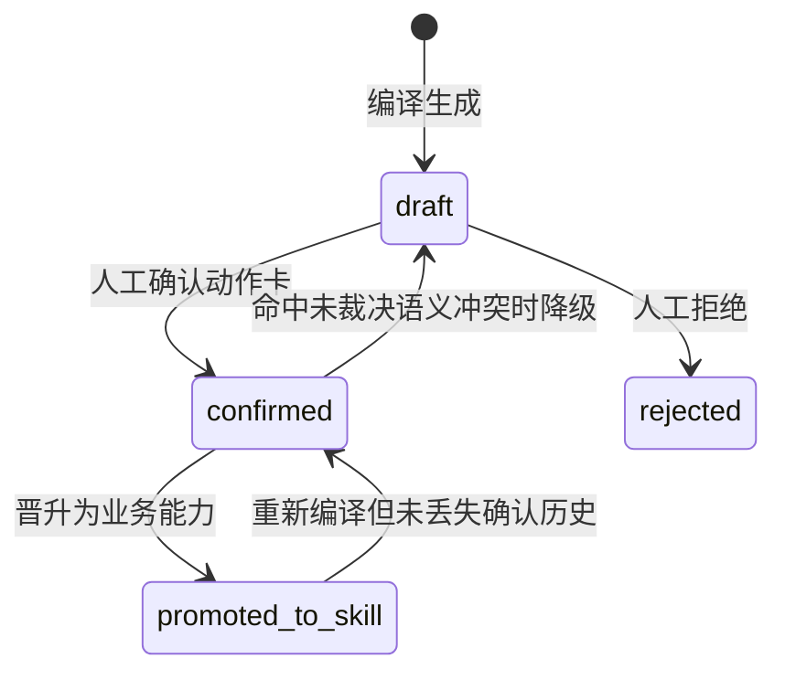
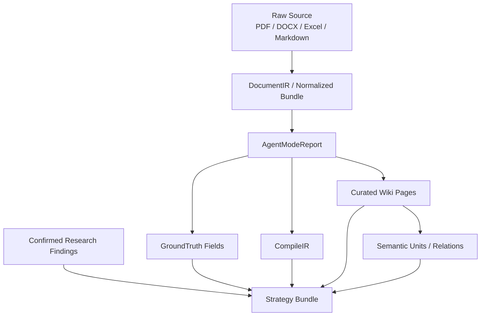
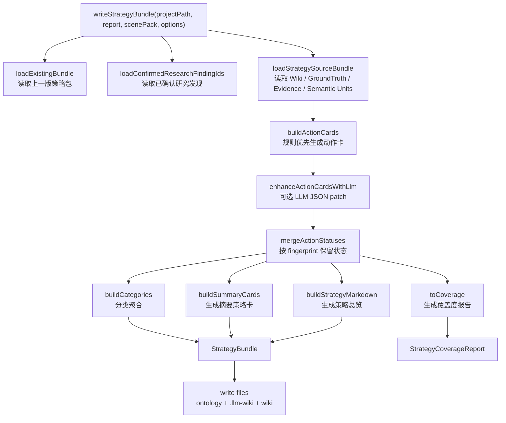
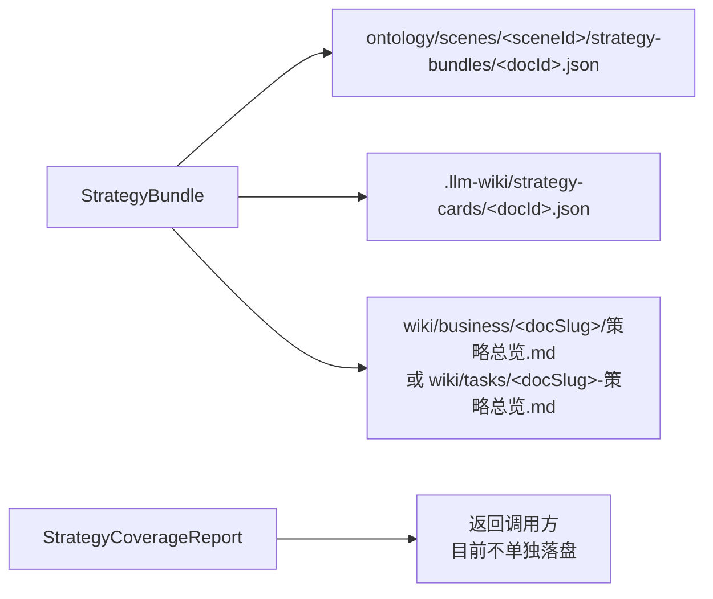
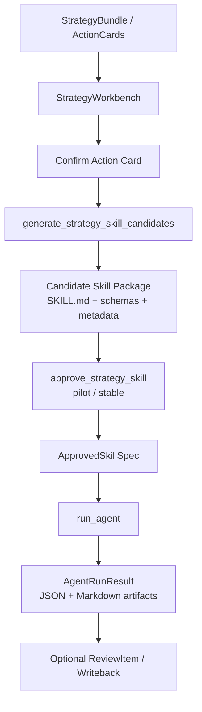

# 策略编译技术报告：定义、编译、评估与应用链路

> 版本：v1  
> 日期：2026-05-22  
> 定位：工程内参 + 产品/企业方案底稿  
> 范围：基于当前代码实现梳理策略资产的定义、编译、评估、应用和线上化改造方向。本文不引用 raw/wiki/memory 中的业务正文，不包含密钥、客户数据或缓存内容。

## 1. 执行摘要

当前系统里的“策略编译”不是让大模型直接写一段经营建议，也不是普通 RAG 问答后的自然语言总结。它更接近一条可治理的知识资产生产线：

```text
Curated Wiki / GroundTruth / CompileIR / Semantic Units
-> Strategy Bundle
-> Action Cards
-> Skill Candidate
-> Approved Skill
-> Agent Run Artifact / Review 回流
```

策略编译的核心目标，是把已经经过文档解析、Wiki 沉淀、字段抽取、证据映射和人审治理的知识，转成“可审查、可确认、可晋升、可执行”的业务动作资产。策略卡不是最终事实，也不是自动执行命令，而是介于 Wiki 知识层和 Agent Runtime 之间的候选行动层。

从分层架构看，策略编译位于 Personal Brain OS 的第三层到第四层之间：

| 层级 | 资产 | 策略编译中的角色 |
| --- | --- | --- |
| Raw Sources | `raw/` 原始文档 | 不直接改写；只通过解析产物和证据锚点间接进入策略 |
| Curated Wiki | `wiki/` 人可读知识页 | 策略编译的主要知识输入和解释依据 |
| Ontology / Work Assets | `GroundTruth`、`CompileIR`、semantic units、strategy bundle | 将知识结构化为字段、证据、冲突、动作卡 |
| Agent Runtime / Skills | candidate skill、approved skill、agent run | 只有确认后的策略动作才可进入可执行能力链路 |

工程上，策略编译的主入口是 `writeStrategyBundle()`，定义在 `/Users/yichen/Desktop/OntologyBrain/LLM-wiki/open_llm_wiki/src/lib/strategy-compile.ts:791`。它读取当前文档的 `AgentModeReport`、项目 `ScenePack`、Wiki 页面、GroundTruth 字段、语义单元索引和已确认研究发现，生成三类产物：

| 产物 | 路径 | 用途 |
| --- | --- | --- |
| 机器可读策略包 | `ontology/scenes/<sceneId>/strategy-bundles/<docId>.json` | 面向结构化资产层和未来线上服务 |
| 工作态 sidecar | `.llm-wiki/strategy-cards/<docId>.json` | 前端策略工作台、Skill 生成、Agent runtime 读取 |
| 人可读策略总览 | `wiki/business/<docSlug>/策略总览.md` 或 `wiki/tasks/<docSlug>-策略总览.md` | 面向人工审阅和 Wiki 导航 |

当前实现已经具备完整雏形：规则优先生成动作卡，可选 LLM 补强，保留证据锚点和 Wiki 引用，识别未裁决语义冲突，支持策略工作台确认动作卡，并将 confirmed/promoted 动作卡生成 Skill 候选，最终由 Python `SkillExecutionEngine` 执行。

但它也有几个明显的线上化前差距：非主图场景目前在编译器中仍主要落到 `generic` 策略类型；策略质量评估偏 coverage 和缺失项，还没有形成完整的策略价值评分；`strategyCompile` 在 ingest 中可能造成耗时，应作为可选增强或批量后处理；策略包版本、审计、租户隔离和回滚机制仍需服务化设计。

## 2. 策略定义

### 2.1 什么是“策略”

在当前系统里，策略不是一句建议，而是一组带来源、触发条件、必要输入、动作步骤、产出物、验证指标、缺失项和状态的结构化行动资产。

一个合格策略至少要回答八个问题：

| 问题 | 对应字段 |
| --- | --- |
| 什么时候应该触发？ | `triggerCondition` |
| 需要哪些输入？ | `requiredInputs` |
| 具体怎么做？ | `actionSteps` |
| 最终交付什么？ | `outputArtifact` |
| 如何判断有效？ | `validationMetrics` |
| 依据来自哪里？ | `evidenceRefs`、`wikiRefs` |
| 还缺什么？ | `missingInputs` |
| 现在能否进入执行链路？ | `status`、`blockedBySemanticRelationIds` |

这一定义让策略从“LLM 的回答文本”升级成“可被评审、检索、排序、晋升和执行”的业务对象。

### 2.2 核心类型

策略相关类型主要定义在 `/Users/yichen/Desktop/OntologyBrain/LLM-wiki/open_llm_wiki/src/lib/agent-mode-types.ts`。

| 类型 | 位置 | 含义 |
| --- | --- | --- |
| `StrategyActionCard` | `agent-mode-types.ts:776` | 最小可执行动作卡，是策略编译的核心资产 |
| `StrategyCard` | `agent-mode-types.ts` | 按策略类型聚合后的摘要卡，兼容早期策略展示 |
| `StrategyCategory` | `agent-mode-types.ts` | 策略分类，连接 card type、source fields 和 action card IDs |
| `StrategyBundle` | `agent-mode-types.ts:824` | 单文档策略包，包含 action cards、summary cards、warnings、证据、Wiki refs |
| `StrategyCoverageReport` | `agent-mode-types.ts:873` | 策略覆盖度报告，用于解释哪些维度已覆盖、哪些缺失 |
| `StrategySkillCandidateManifest` | `agent-mode-types.ts:891` | confirmed/promoted 动作卡生成的业务能力候选 |
| `ApprovedSkillSpec` | `agent-mode-types.ts:911` | 经过审批后的可运行 Skill |
| `AgentRunRequest` / `AgentRunResult` | `agent-mode-types.ts:931` / `agent-mode-types.ts:1013` | Agent 执行请求与运行产物 |

### 2.3 `StrategyActionCard`

`StrategyActionCard` 是策略编译中最重要的对象。它不是摘要，而是面向后续 Skill/Agent 的行动契约。

关键字段如下：

| 字段 | 说明 |
| --- | --- |
| `actionCardId` | 动作卡 ID，供前端状态更新和 Skill 候选追溯 |
| `fingerprint` | 稳定指纹，用于下一轮重编译时保留确认状态 |
| `sceneId` / `docId` | 所属场景和来源文档 |
| `category` | 策略类型，例如人群诊断、卖点选择、素材表达、指标判断、优化动作、实验验证或 generic |
| `title` | 人可读标题 |
| `triggerCondition` | 业务触发条件 |
| `requiredInputs` | 运行前必要输入 |
| `actionSteps` | 可执行步骤 |
| `outputArtifact` | 产出物，例如素材 brief、归因表、优化动作清单 |
| `validationMetrics` | 验证指标 |
| `evidenceRefs` | 字段级或块级证据锚点 |
| `semanticUnitIds` | 消费的语义单元 ID |
| `blockedBySemanticRelationIds` | 未裁决语义冲突，存在时不应默认晋升 |
| `wikiRefs` | 支撑策略的 Wiki 页面 |
| `missingInputs` | 缺失输入 |
| `confidence` | 当前动作卡置信度 |
| `skillFamily` | 后续生成 Skill 时的能力家族 |
| `sourceFieldKeys` | 来自哪些 schema 字段 |
| `sourceFindingIds` | 关联的已确认 research findings |
| `status` | `draft`、`confirmed`、`rejected`、`promoted_to_skill` |

其中 `fingerprint` 非常关键。它由策略类型、触发条件、产出物和目标字段组成，用于在重新编译时识别“这是同一张业务动作卡”，从而保留用户之前确认或晋升过的状态。

### 2.4 `StrategyBundle`

`StrategyBundle` 是单个文档或单个编译对象的策略资产包。它承载四类信息：

| 信息类型 | 字段 |
| --- | --- |
| 基本身份 | `bundleId`、`docId`、`sceneId`、`title`、`summary` |
| 策略内容 | `strategyMarkdown`、`strategyCards`、`strategyCategories`、`actionCards` |
| 证据与治理 | `linkedWikiRefs`、`evidenceRefs`、`consumedSemanticUnitIds`、`unresolvedSemanticRelationIds` |
| 生命周期 | `warnings`、`llmEnhanced`、`linkedResearchFindingIds`、`linkedRevisionCardIds`、`generatedAt` |

它同时服务三类消费者：

1. 前端策略工作台：展示策略动作卡、确认状态、生成能力候选。
2. Python Agent Runtime：读取策略包并执行 approved skill 或 fallback action cards。
3. 未来线上服务：作为策略版本、审计、评估和租户化治理的结构化对象。

### 2.5 策略状态流

当前策略状态定义为：

```text
draft -> confirmed -> promoted_to_skill
draft -> rejected
```



治理原则是：`draft` 只是候选策略；`confirmed` 可以生成 Skill 候选；`promoted_to_skill` 表示已进入业务能力链路；命中未裁决语义冲突时，即使历史上确认过，也应回到更保守状态。

## 3. 策略输入资产

策略编译不是直接吃原始文档，而是消费一批已经结构化或治理过的资产。



### 3.1 `AgentModeReport`

`AgentModeReport` 是策略编译的主输入，来自文档解析与场景编译链路。它包含：

| 区域 | 策略编译用途 |
| --- | --- |
| `sourceName`、`sourcePath`、`docId`、`sceneId` | 确定策略包身份、输出路径和场景 |
| `understanding.summary` | 策略包摘要和策略总览开头 |
| `understanding.decisionPoints` | 主图场景下辅助生成 linked decision point IDs |
| `groundTruth.fields` | 形成策略 source fields、required inputs、证据引用 |
| `compileIr.fieldEvidenceMap` / `sourceRefsByField` | 字段级证据锚点 |
| `revisionIssueCards` | 连接策略包和 Review/修订卡 |
| `supportingWikiPages` | 补充 Wiki refs |
| `compileIr` | 提供 metrics、business rules、evidence cases 等结构化线索 |

### 3.2 `ScenePack`

`ScenePack` 定义项目场景，包括 manifest、purpose、schema、evaluation profile 和 strategy profile。类型定义位于 `/Users/yichen/Desktop/OntologyBrain/LLM-wiki/open_llm_wiki/src/lib/agent-mode-types.ts:103`，加载逻辑位于 `/Users/yichen/Desktop/OntologyBrain/LLM-wiki/open_llm_wiki/src/lib/scene-pack.ts:403`。

策略编译最关注其中的 `strategyProfile`。它决定：

| 配置 | 作用 |
| --- | --- |
| `scene_id` | 声明策略配置所属场景 |
| `card_types[].key` | 策略类型 |
| `card_types[].label` | 前端和报告中的中文分类名 |
| `card_types[].source_field_keys` | 从哪些 GroundTruth/schema 字段抽策略 |
| `card_types[].action_template.trigger_cues` | 触发条件线索 |
| `card_types[].action_template.required_inputs` | 运行前必要输入 |
| `card_types[].action_template.output_artifact` | 预期产出 |
| `card_types[].action_template.validation_metrics` | 验证指标 |
| `skill_family_mapping` | 策略类型到 Skill family 的映射 |

默认 `StrategyProfile` 由 `defaultStrategyProfile()` 生成，入口在 `/Users/yichen/Desktop/OntologyBrain/LLM-wiki/open_llm_wiki/src/lib/scene-pack.ts:221`。

### 3.3 Wiki 页面

策略编译读取 Wiki 页面，而不是直接读取 raw 文档正文。当前实现中：

| 场景 | Wiki 输入 |
| --- | --- |
| 主图场景 | `wiki/business/<docSlug>/index.md`、`人群与场景.md`、`卖点与表达.md`、`素材与版式.md`、`指标与判断.md`、`动作与实验.md`、`证据与案例.md` |
| 经营任务场景 | `wiki/tasks/<docSlug>.md`、`wiki/roles/<docSlug>.md`、`wiki/quality/<docSlug>.md`、`wiki/collaboration/<docSlug>.md`、`wiki/reviews/<docSlug>.md` |

这符合仓库分层原则：策略应从 curated wiki 和结构化字段中产生，而不是让 Agent 直接消费 raw-only 内容。

### 3.4 GroundTruth 与 CompileIR

`GroundTruth` 是当前文档的字段化业务底稿；`CompileIR` 是编译阶段产生的更细结构化表示。策略编译会从中读取：

| 来源 | 用途 |
| --- | --- |
| `groundTruth.fields[].key/value` | 作为候选策略的核心文本 |
| `groundTruth.fields[].evidenceBlockRefs` | 进入动作卡证据 |
| `compileIr.fieldEvidenceMap` | 字段级证据映射 |
| `compileIr.sourceRefsByField` | 当 `fieldEvidenceMap` 缺失时的兜底来源引用 |
| `compileIr.metrics` | 辅助验证指标 |

当前代码已经对旧报告兼容，字段证据读取使用：

```text
compileIr.fieldEvidenceMap?.[key] ?? compileIr.sourceRefsByField?.[key] ?? []
```

这意味着缺失字段级 evidence map 不再被视为解析失败，而是降级为“没有字段级证据锚点”。

### 3.5 Semantic Units 与未裁决冲突

策略编译会读取语义单元索引，定位每个策略字段关联了哪些 semantic units，并进一步查找这些语义单元是否存在未裁决关系。相关调用在 `/Users/yichen/Desktop/OntologyBrain/LLM-wiki/open_llm_wiki/src/lib/strategy-compile.ts:464` 附近。

其意义是：当多文档之间存在冲突、范围差异或覆盖关系时，策略不能简单把冲突抹平。未裁决冲突会写入：

| 字段 | 说明 |
| --- | --- |
| `StrategyActionCard.semanticUnitIds` | 当前动作卡消费的语义单元 |
| `StrategyActionCard.blockedBySemanticRelationIds` | 阻塞晋升的未裁决关系 |
| `StrategyBundle.consumedSemanticUnitIds` | 整个策略包消费的语义单元 |
| `StrategyBundle.unresolvedSemanticRelationIds` | 整个策略包命中的未裁决冲突 |

### 3.6 Research Findings

`loadConfirmedResearchFindingIds()` 会读取 `wiki/research/*/session.json`，只关联 promotion state 非 idle 的 research findings。这样 Deep Research 的结果不会自动进入策略，只有经过确认或晋升的发现才会成为策略依据。

## 4. 策略编译流程

当前策略编译主流程如下：



### 4.1 主入口：`writeStrategyBundle()`

`writeStrategyBundle()` 位于 `/Users/yichen/Desktop/OntologyBrain/LLM-wiki/open_llm_wiki/src/lib/strategy-compile.ts:791`。

它的输入为：

| 参数 | 说明 |
| --- | --- |
| `projectPath` | 项目根目录 |
| `report` | 当前文档的 `AgentModeReport` |
| `scenePack` | 当前项目的场景包 |
| `options.llmConfig` | 可选 LLM 配置 |
| `options.signal` | AbortSignal，用于中断 |
| `options.enhanceWithLlm` | 是否启用 LLM 动作卡补强 |

它的输出为：

| 返回字段 | 说明 |
| --- | --- |
| `bundle` | 完整 `StrategyBundle` |
| `coverage` | `StrategyCoverageReport` |
| `writtenPaths` | 实际写入的文件路径 |

### 4.2 读取策略输入：`loadStrategySourceBundle()`

`loadStrategySourceBundle()` 位于 `/Users/yichen/Desktop/OntologyBrain/LLM-wiki/open_llm_wiki/src/lib/strategy-compile.ts:464`。

它组装策略编译所需的 source bundle：

| 字段 | 来源 |
| --- | --- |
| `docSlug` | `sourceName` 规范化 |
| `wikiPages` | 当前场景对应的 Wiki 页面 |
| `groundTruthFields` | `report.groundTruth.fields` |
| `fieldEvidence` | `groundTruth.evidenceBlockRefs + compileIr.fieldEvidenceMap/sourceRefsByField` |
| `semanticUnitIdsByField` | semantic unit index |
| `unresolvedSemanticRelationIdsByField` | semantic relation index |

这个步骤决定策略编译是否“有根”。如果 Wiki 页面缺失、GroundTruth 字段弱、field evidence 缺失，后续动作卡仍可能生成，但会在 `missingInputs`、`confidence`、coverage root cause 和 warnings 中体现质量缺口。

### 4.3 规则优先生成动作卡：`buildActionCards()`

`buildActionCards()` 位于 `/Users/yichen/Desktop/OntologyBrain/LLM-wiki/open_llm_wiki/src/lib/strategy-compile.ts:509`。

它按策略类型执行以下逻辑：

1. 根据 `sceneId` 决定策略类型集合。
2. 读取 `StrategyProfile.card_types[].source_field_keys`。
3. 从 Wiki 页面和 GroundTruth 字段中拼接 source text。
4. 将 source text 切分为候选条目。
5. 生成触发条件、动作步骤、产出物和验证指标。
6. 绑定 evidence refs、semantic unit IDs、unresolved relation IDs、wiki refs。
7. 根据证据数量、Wiki 引用数量和缺失输入估算 confidence。
8. 输出 `StrategyActionCard`。

其中主图场景当前使用固定的六类策略：

| 策略类型 | 业务含义 |
| --- | --- |
| `audience_segment_diagnosis` | 人群诊断 |
| `value_prop_selection` | 卖点选择 |
| `creative_asset_brief_generation` | 素材表达 |
| `metric_signal_diagnosis` | 指标判断 |
| `optimization_action_planning` | 优化动作 |
| `experiment_validation_plan` | 实验验证 |

非主图场景当前主要走 `generic`。这是后续优化经营任务策略编译时最重要的差距之一：虽然项目级 `StrategyProfile.yaml` 已经可以定义 `goal_alignment`、`role_task_decomposition`、`meeting_to_task_compilation` 等类型，但当前 `StrategyCardType` union 和 `buildActionCards()` 尚未完全动态消费这些自定义类型。

### 4.4 可选 LLM 补强：`enhanceActionCardsWithLlm()`

`enhanceActionCardsWithLlm()` 位于 `/Users/yichen/Desktop/OntologyBrain/LLM-wiki/open_llm_wiki/src/lib/strategy-compile.ts:380`。

它不是让 LLM 从零生成策略，而是让 LLM 对规则候选卡做 JSON patch：

| 约束 | 目的 |
| --- | --- |
| 只允许返回 JSON | 保证可解析和可测试 |
| 不允许新增 `actionCardId` | 防止模型绕过规则生成不可追溯资产 |
| 只能按输入卡修改字段 | 保持候选卡身份稳定 |
| 缺少输入写入 `missingInputs` | 防止伪造证据 |
| 不直接塞 GroundTruth 原文到 action steps | 保持动作步骤可执行 |

如果没有可用 LLM、调用失败或 JSON 解析失败，系统会降级保留规则动作卡，并在 `StrategyBundle.warnings` 中记录原因。

这体现了一个重要设计原则：LLM 是策略补强器，不是策略资产主干。策略主干来自 schema、wiki、GroundTruth、evidence refs 和规则。

### 4.5 状态合并：`mergeActionStatuses()`

`mergeActionStatuses()` 位于 `/Users/yichen/Desktop/OntologyBrain/LLM-wiki/open_llm_wiki/src/lib/strategy-compile.ts:572`。

它解决“重新编译会不会丢掉人工确认状态”的问题：

| 情况 | 行为 |
| --- | --- |
| 新卡 fingerprint 命中旧卡 | 复用旧 `actionCardId`、`createdAt` 和确认状态 |
| 命中旧卡但存在未裁决语义冲突 | 保守降级为 `draft` |
| 未命中新卡但旧 summary card 已 confirmed/promoted | 在无冲突时继承旧状态 |
| 全新动作卡 | 保持 `draft` |

这使得策略包可以反复编译、迭代和增强，同时不轻易丢掉人工治理结果。

### 4.6 分类与摘要：`buildCategories()` / `buildSummaryCards()`

`buildCategories()` 位于 `/Users/yichen/Desktop/OntologyBrain/LLM-wiki/open_llm_wiki/src/lib/strategy-compile.ts:600`，负责把动作卡按 category 聚合，形成前端分组展示的结构。

`buildSummaryCards()` 位于 `/Users/yichen/Desktop/OntologyBrain/LLM-wiki/open_llm_wiki/src/lib/strategy-compile.ts:617`，负责为每个 category 生成摘要策略卡，兼容早期 `strategyCards` 展示和状态判断。

建议未来继续以 `actionCards` 为主，`strategyCards` 作为摘要层或兼容层。

### 4.7 人可读策略总览：`buildStrategyMarkdown()`

`buildStrategyMarkdown()` 位于 `/Users/yichen/Desktop/OntologyBrain/LLM-wiki/open_llm_wiki/src/lib/strategy-compile.ts:656`。

它生成的 Markdown 包含：

| 区块 | 内容 |
| --- | --- |
| 标题与摘要 | 来源文档名、理解摘要 |
| 可执行动作卡矩阵 | 按策略分类列出触发条件、必要输入、产出物、验证指标、状态、缺失项 |
| 执行步骤 | 每张动作卡的 action steps |
| Wiki 引用和证据锚点 | 人工审阅时可回溯 |
| 多来源证据与分歧 | 未裁决 semantic relation 的提示 |

这个文件写入 `wiki/`，因此要保持人类可读；但它不应该取代结构化 `StrategyBundle`，后者才是 Agent 和 Skill 消费的主资产。

### 4.8 覆盖度报告：`toCoverage()`

`toCoverage()` 位于 `/Users/yichen/Desktop/OntologyBrain/LLM-wiki/open_llm_wiki/src/lib/strategy-compile.ts:707`。

它用固定维度评估策略覆盖情况：

| 维度 | 说明 |
| --- | --- |
| `business_goal` | 是否有明确业务目标 |
| `audience_segment` | 是否形成稳定人群诊断动作卡 |
| `value_proposition` | 是否形成卖点选择动作卡 |
| `creative_asset_pattern` | 是否形成素材表达动作卡 |
| `metric_signal` | 是否形成指标诊断动作卡 |
| `optimization_action` | 是否形成优化动作卡 |
| `validation_plan` | 是否形成实验验证动作卡 |

每个维度都有 `covered`、`detail`、`linkedCardIds` 和 `rootCause`。root cause 包括：

| root cause | 含义 |
| --- | --- |
| `written` | 已生成有效内容 |
| `missing_source_evidence` | 缺源证据 |
| `missing_decision_projection` | 缺决策投影 |
| `missing_trigger_condition` | 缺触发条件 |
| `missing_action_steps` | 缺动作步骤 |
| `missing_output_artifact` | 缺产出物 |
| `missing_validation_metric` | 缺验证指标 |
| `missing_wiki_refs` | 缺 Wiki 引用 |
| `missing_evidence_refs` | 缺证据引用 |
| `not_skill_ready` | 有缺失输入，暂不适合晋升为 Skill |

### 4.9 写入产物

`writeStrategyBundle()` 最终写入：



这三个写入目标对应三种使用方式：结构化资产、前端工作态、人工可读沉淀。

## 5. 策略评估机制

策略评估应分成五层：结构完整度、证据可追溯性、业务可执行性、治理安全性、运行效果。

### 5.1 当前已实现评估

当前实现已经覆盖：

| 评估项 | 当前机制 |
| --- | --- |
| 维度覆盖 | `StrategyCoverageReport` |
| 缺失输入 | `missingInputs` |
| 证据引用 | `evidenceRefs` |
| Wiki 支撑 | `wikiRefs` |
| 语义冲突 | `blockedBySemanticRelationIds`、`unresolvedSemanticRelationIds` |
| 置信度 | 基于 evidence refs、wiki refs、missing inputs 的规则估算 |
| LLM 可用性 | `warnings`、`llmEnhanced` |
| Skill readiness | `not_skill_ready` root cause、confirmed/promoted 状态 |

### 5.2 动作卡质量评分建议

建议未来为每张 `StrategyActionCard` 增加独立评分卡，而不只依赖 coverage：

| 评分维度 | 权重建议 | 判定标准 |
| --- | ---: | --- |
| 目标和触发清晰度 | 15% | `triggerCondition` 是否具体、是否可判断 |
| 输入完整度 | 15% | `requiredInputs` 是否明确，`missingInputs` 是否可补 |
| 动作可执行度 | 25% | `actionSteps` 是否是可执行步骤，而非泛化建议 |
| 产出物清晰度 | 15% | `outputArtifact` 是否可交付、可检查 |
| 验证闭环 | 15% | `validationMetrics` 是否能衡量效果 |
| 证据可追溯 | 15% | `evidenceRefs`、`wikiRefs`、semantic units 是否充足 |

可定义四档：

| 分数 | 等级 | 使用建议 |
| ---: | --- | --- |
| 85-100 | ready | 可进入人工确认或试运行候选 |
| 70-84 | needs_review | 有价值但需补输入或证据 |
| 50-69 | weak | 只能作为线索，不建议生成 Skill |
| 0-49 | blocked | 缺关键字段或命中严重冲突 |

### 5.3 Skill readiness 判断

一张动作卡要进入 Skill 候选，至少应满足：

1. 状态为 `confirmed` 或 `promoted_to_skill`。
2. 有明确 `actionSteps`。
3. 有明确 `outputArtifact`。
4. 有 `validationMetrics` 或可解释的验证计划。
5. 有 `wikiRefs` 和 `evidenceRefs`。
6. 没有未裁决 semantic conflicts。
7. `missingInputs` 可由用户运行时补充，而不是缺核心业务定义。

当前 Python runtime 已经只从 confirmed/promoted 动作卡生成能力候选。实现见 `/Users/yichen/Desktop/OntologyBrain/LLM-wiki/src/personal_brain/skills/strategy_runtime.py:1598`。

### 5.4 运行后评估

策略真正的价值不止在编译时，而在运行后。`SkillExecutionEngine` 会记录：

| 评估对象 | 字段 |
| --- | --- |
| 输入校验 | `validation_errors` |
| 上下文读取 | `context_refs`、`warnings` |
| 执行阶段 | `execution_timeline` |
| 降级原因 | `degradation_reason` |
| 步骤产物 | `step_executions` |
| 最终结构化输出 | `structured_output` |
| 状态 | `completed`、`degraded`、`needs_input`、`validation_failed` |

这使得策略可以形成闭环：编译时评估的是“这张动作卡能不能变成能力”，运行时评估的是“这个能力是否真的产出了可审阅结果”。

### 5.5 推荐评测集

正式版本前，建议建立策略编译评测集：

| Case 类型 | 评估点 |
| --- | --- |
| 字段齐全的文档 | 应生成多类 action cards，coverage 高 |
| 缺证据的文档 | 应生成缺口提示，不应伪造 evidence refs |
| 有冲突的多文档 | 应写入 `blockedBySemanticRelationIds`，不自动晋升 |
| LLM 不可用 | 应保留规则卡并写 warning |
| 重新编译 | 应通过 fingerprint 保留 confirmed/promoted 状态 |
| 经营任务场景 | 应验证自定义 card types 是否生效，而不是全部 generic |
| Skill 执行 | confirmed 卡能生成候选、审批后可运行、运行产物可追溯 |

## 6. 策略应用链路

策略应用分四步：策略工作台确认、生成 Skill 候选、审批为 approved skill、Agent 执行。



### 6.1 前端策略工作台

前端策略工作台位于 `/Users/yichen/Desktop/OntologyBrain/LLM-wiki/open_llm_wiki/src/components/strategy/strategy-workbench.tsx`。

它主要负责：

| 功能 | 说明 |
| --- | --- |
| 展示当前文档策略包 | 从 `report.strategyBundle` 读取 action cards |
| 更新动作卡状态 | 将动作卡标记为 confirmed、rejected 或 promoted |
| 生成业务能力候选 | 调用 Tauri command `generateStrategySkillCandidates` |
| 审批业务能力 | 调用 `approveStrategySkill`，设置 pilot/stable |
| 运行智能执行助手 | 调用 `runProjectAgent` |
| 创建 ReviewItem | Agent 运行完成后可进入 Review |

策略工作台有一个重要提示：主知识层仍以修订稿和业务知识页为准。策略工作台不是直接写主知识层，而是将策略资产转入能力候选和运行产物。

### 6.2 Tauri 命令边界

前端通过 `/Users/yichen/Desktop/OntologyBrain/LLM-wiki/open_llm_wiki/src/commands/fs.ts` 调用 Tauri 命令，包括：

| 命令 | 用途 |
| --- | --- |
| `generate_strategy_skill_candidates` | 根据策略包生成 Skill 候选 |
| `approve_strategy_skill` | 将候选能力审批为 pilot/stable |
| `run_project_agent` | 运行 Agent |

这是一条重要边界：TypeScript 侧负责编译和 UI，Python Personal Brain 侧负责 Skill 包、approved skill 和 Agent runtime。

### 6.3 生成 Skill 候选

Python 函数 `generate_strategy_skill_candidates()` 位于 `/Users/yichen/Desktop/OntologyBrain/LLM-wiki/src/personal_brain/skills/strategy_runtime.py:1598`。

它只处理状态为 `confirmed` 或 `promoted_to_skill` 的动作卡。对每张动作卡，它生成：

| 文件 | 说明 |
| --- | --- |
| `SKILL.md` | 人可读能力说明，包括触发条件、输入要求、执行步骤、产出物、使用边界、验证标准 |
| `input_schema.json` | 运行输入 schema，至少包含 `objective` |
| `output_schema.json` | 运行输出 schema |
| `execution.json` | 执行模式，默认 `single_plan_local_execute` |
| `metadata.json` | `StrategySkillCandidateManifest` |
| `examples/example_01.md` | 示例 |

候选能力默认仍是候选，不等于正式可运行能力。

### 6.4 审批为 Approved Skill

`approve_strategy_skill()` 位于 `/Users/yichen/Desktop/OntologyBrain/LLM-wiki/src/personal_brain/skills/strategy_runtime.py:1757`。

它将候选能力复制到 approved 目录，并生成 `ApprovedSkillSpec`。审批分为：

| tier | 含义 |
| --- | --- |
| `pilot` | 试运行能力 |
| `stable` | 正式启用能力 |

审批后的能力包含：

| 字段 | 说明 |
| --- | --- |
| `skill_id` | 能力 ID |
| `title` | 能力名称 |
| `scene_id` | 适用场景 |
| `tier` | pilot/stable |
| `family` | 能力家族 |
| `path` | 能力目录 |
| `wiki_refs` | 知识依据 |
| `source_refs` | 来源证据 |
| `input_schema` | 输入约束 |
| `output_schema` | 输出约束 |
| `execution_spec` | 执行方式 |

### 6.5 Agent Run

`run_agent()` 位于 `/Users/yichen/Desktop/OntologyBrain/LLM-wiki/src/personal_brain/skills/strategy_runtime.py:1830`。

它执行以下步骤：

1. 读取 approved skills。
2. 按用户选择或 `docId/sceneId` 自动选择能力。
3. 读取 `.llm-wiki/strategy-cards/<docId>.json`。
4. 对每个 selected skill 调用 `SkillExecutionEngine.execute()`。
5. 如果没有 selected skill，则对 action cards 做 fallback execution。
6. 汇总执行结果。
7. 保存 JSON 和 Markdown 运行产物。

`SkillExecutionEngine` 定义在 `/Users/yichen/Desktop/OntologyBrain/LLM-wiki/src/personal_brain/skills/strategy_runtime.py:291`，核心执行方法位于同文件 `:298`。

当前支持的执行模式包括：

| 模式 | 说明 |
| --- | --- |
| `single_plan_local_execute` | 先由 LLM 生成一次性执行计划，再本地执行步骤并合成最终产物 |
| `llm_structured` | 逐步骤调用 LLM 结构化执行 |
| `template` | 模板兜底模式 |

### 6.6 运行产物

`AgentRunResult` 包含：

| 字段 | 说明 |
| --- | --- |
| `runId` | 运行 ID |
| `selectedSkillIds` | 使用的 approved skills |
| `groundingSources` | 用户/前端提供的 grounding sources |
| `status` | completed/degraded/needs_input/validation_failed/error |
| `structuredOutput` | 结构化业务产物 |
| `validationErrors` | 输入/输出校验错误 |
| `executionTimeline` | 阶段级执行时间线 |
| `degradationReason` | 降级原因 |
| `stepExecutions` | 步骤级执行记录 |
| `contextRefs` | 实际读取的上下文 |
| `outputArtifacts` | 保存的 JSON/Markdown 路径 |

这保证 Agent 的输出不是不可追溯的聊天内容，而是可以审计、复查和回流的运行记录。

## 7. 场景化策略设计

### 7.1 主图场景

主图场景 `ecom_growth_hero_image` 当前是策略编译支持最完整的场景。它围绕电商主图优化形成六类动作：


这些类型在 `StrategyCardType` union 中显式定义，并在 `HERO_TYPES` 中固定使用。每个类型有对应的 source fields、Wiki 页面和默认 action steps。

### 7.2 经营任务生成场景

经营任务生成场景的 `StrategyProfile.yaml` 已经可以定义更贴近任务生成引擎的策略类型，例如：

| 策略类型 | 作用 |
| --- | --- |
| `goal_alignment` | 目标对齐 |
| `role_task_decomposition` | 角色拆解 |
| `meeting_to_task_compilation` | 会议转任务 |
| `quality_scoring` | 质量评分 |
| `collaboration_orchestration` | 协同编排 |
| `review_sinking` | 复盘沉淀 |

这些配置非常适合经营任务生成引擎，因为它们能把任务卡的核心要素、质量标准、角色协同和复盘闭环转成策略动作。

但当前编译器存在一个实现落差：`buildActionCards()` 对非主图场景主要使用 `generic`。这意味着经营任务项目虽然有更丰富的 `StrategyProfile.yaml`，但策略编译还没有完全动态展开自定义 card types。

建议后续将 `StrategyCardType` 从固定 union 升级为“内置类型 + profile 自定义类型”，并让 `buildActionCards()` 优先使用 `scenePack.strategyProfile.card_types`。

### 7.3 行业 Wiki 与企业 Wiki 的策略继承

策略 Profile 在未来线上版中应分为两层：

| 层 | 内容 | 权限 |
| --- | --- | --- |
| 行业策略 Profile | 行业通用 card types、动作模板、验证指标、Skill family | 平台发布，只读版本 |
| 企业策略 Overlay | 企业角色、指标口径、审批链路、执行约束、场景禁忌 | 租户私有，可治理 |

企业策略不应直接覆盖行业策略，而应以 overlay 方式声明：

1. 继承哪些行业策略类型。
2. 覆盖哪些验证指标或输入要求。
3. 哪些行业策略不适用于本企业。
4. 企业新增哪些策略动作。
5. 冲突时是否需要 Review。

### 7.4 策略与任务卡的关系

在经营任务生成场景中，需要区分“任务卡”和“策略卡”：

| 资产 | 作用 |
| --- | --- |
| `TaskCardDraft` / `TaskIndexEntry` | 真实经营任务列表，回答“谁在什么时候做什么” |
| `StrategyActionCard` | 方法层动作，回答“如何把目标、角色、会议、指标编译成高质量任务” |
| `TaskRulePack` / `TaskTaxonomy` | 机制层规则，回答“什么样的任务算高质量” |
| `ApprovedSkillSpec` | 可执行能力，回答“Agent 如何稳定执行某类策略动作” |

因此，不应把所有任务卡直接当策略卡，也不应把顶层机制文档生成真实任务。策略卡更适合表达“任务生成和优化的方法”，任务卡更适合表达“具体经营动作”。

## 8. 治理边界

### 8.1 策略卡不是事实层

策略卡属于候选行动资产，不是事实真相。它不能直接覆盖 raw、wiki、GroundTruth 或 ontology。原因有三点：

1. 策略包含判断和建议，不等同于来源事实。
2. 策略可能受缺失输入和上下文约束影响。
3. 策略进入 Agent 执行会带来业务影响，必须保留确认边界。

### 8.2 默认写入边界

| 动作 | 是否自动发生 | 原因 |
| --- | --- | --- |
| 写 raw | 否 | raw append-only，不被策略改写 |
| 写 Wiki 主知识页 | 否 | 策略总览可写入 wiki，但不覆盖主知识结论 |
| 写 GroundTruth | 否 | GroundTruth 需要 Review/修订流程 |
| 生成 Skill 候选 | 仅 confirmed/promoted 动作卡 | 防止草案能力化 |
| Approved Skill | 需要审批 | 区分候选能力和可运行能力 |
| Agent Run | 用户触发 | 执行结果是运行产物，不自动回写主知识层 |
| ReviewItem | 可选创建 | 作为人工审阅入口 |

### 8.3 冲突处理边界

未裁决 semantic relation 是策略晋升的重要红线。策略包可以展示命中冲突的动作卡，但不应让这些动作卡默认进入 Skill 或 Agent 自动执行。

推荐规则：

| 冲突状态 | 策略处理 |
| --- | --- |
| `supports` / `duplicates` | 可增强 confidence |
| `refines` | 可作为补充上下文 |
| `scope_differs` | 必须在适用范围中说明 |
| `contradicts` | 进入 Review，默认不晋升 |
| `supersedes` | 旧策略需降级或标记过期 |

### 8.4 人审边界

策略链路中至少有三个需要人工确认的位置：

1. 动作卡从 `draft` 到 `confirmed`。
2. Skill 候选从 candidate 到 approved pilot/stable。
3. Agent run 产物是否回写到 Wiki、Review 或业务系统。

这三个边界应该在产品体验中保持显性，不能因为 LLM 输出顺滑就自动跳过。

## 9. 当前不足与优化建议

### 9.1 自定义策略类型动态化

当前 `StrategyProfile.yaml` 已经支持定义自定义 card types，但 TypeScript 类型和 `buildActionCards()` 仍偏固定类型。建议：

1. 将 `StrategyCardType` 拆成内置类型和字符串扩展类型。
2. `buildActionCards()` 优先读取 `scenePack.strategyProfile.card_types`。
3. 对缺少内置 action step 模板的自定义类型，用 profile action template 生成步骤。
4. coverage 维度从固定主图维度升级为 profile-driven coverage。
5. 前端展示用 profile label，不依赖固定枚举。

这对经营任务生成探索项目尤其重要，因为它需要 `goal_alignment`、`meeting_to_task_compilation`、`quality_scoring` 等任务策略类型真实生效。

### 9.2 策略质量评分

当前策略评估主要是 coverage 和 root cause。建议新增 `StrategyActionQualityScorecard`：

```ts
interface StrategyActionQualityScorecard {
  score: number
  level: "ready" | "needs_review" | "weak" | "blocked"
  completenessScore: number
  executableScore: number
  evidenceScore: number
  governanceScore: number
  missingElements: string[]
  reviewNotes: string[]
}
```

这会让策略工作台更容易区分“看起来有内容”和“真的能作为能力候选”。

### 9.3 strategyCompile 可选化与性能优化

前面 ingest 性能定位已经暴露：`strategyCompile` 对一些项目不是首屏必需。建议将其从 ingest 核心链路中拆成可选增强：

| 模式 | 行为 |
| --- | --- |
| `fast` | 只生成 Wiki / GroundTruth / TaskContextPack，不运行策略编译 |
| `balanced` | 批量结束后 deferred strategyCompile |
| `full_quality` | 同步运行策略编译、LLM 增强、embedding、review sweep |

资料页导入前可以给用户选择：

1. 只编译 Wiki 和任务卡。
2. 编译 Wiki + 策略卡。
3. 全量增强，包括策略、embedding、图片 caption、评估。

这样能避免经营任务项目在大量 Excel/DOCX/PDF ingest 时，因为每个文件同步跑策略增强而拖慢主流程。

### 9.4 LLM 增强治理

当前 LLM 增强已经有 JSON patch 和不新增 action ID 的约束。建议继续增强：

1. 对 LLM patch 前后做 diff，记录哪些字段被修改。
2. LLM 不得删除 evidence refs 和 wiki refs。
3. 如果 LLM 修改 action steps，需要保留 rule steps 作为 base。
4. LLM 输出必须通过 strategy quality scorecard。
5. LLM 增强结果应标记 `enhancementSource: "llm_patch"`。

### 9.5 策略与任务索引联动

经营任务项目中，任务卡检索和策略编译应形成清晰分工：

| 用户问题 | 应走链路 |
| --- | --- |
| “运营负责人 12 月任务列表” | `task-index.json` / `searchTaskCards()` |
| “如何把周会纪要转成任务？” | 策略卡 / task rule pack / wiki |
| “这个任务为什么 needs_review？” | task quality scorecard |
| “生成一套下周运营任务编排方案” | confirmed strategy action -> approved skill -> Agent run |

策略编译不应污染任务索引；任务索引也不应替代策略方法层。

### 9.6 线上化改造

线上正式版建议补齐：

| 能力 | 说明 |
| --- | --- |
| Strategy Bundle Versioning | 策略包版本、diff、回滚 |
| Tenant Isolation | 行业策略和企业策略 overlay 隔离 |
| Strategy Audit Log | 谁确认、谁晋升、谁运行、用了哪个模型 |
| Async Worker | strategyCompile 进入后台任务队列 |
| Quality Gate | 低分策略不能晋升 Skill |
| Skill Registry | approved skill 版本、灰度、禁用、回滚 |
| Eval Harness | 策略编译 golden cases 和 LLM judge |
| Runtime Observability | Agent run 的阶段耗时、失败原因、上下文命中 |

## 10. 附录

### 10.1 代码映射表

| 模块 | 路径 | 作用 |
| --- | --- | --- |
| 策略编译器 | `/Users/yichen/Desktop/OntologyBrain/LLM-wiki/open_llm_wiki/src/lib/strategy-compile.ts` | 生成 `StrategyBundle`、动作卡、策略总览和 coverage |
| 策略类型契约 | `/Users/yichen/Desktop/OntologyBrain/LLM-wiki/open_llm_wiki/src/lib/agent-mode-types.ts` | 定义策略、Skill、Agent run 的 TypeScript 类型 |
| 场景包加载 | `/Users/yichen/Desktop/OntologyBrain/LLM-wiki/open_llm_wiki/src/lib/scene-pack.ts` | 加载 `StrategyProfile.yaml` 等场景配置 |
| 策略展示文案 | `/Users/yichen/Desktop/OntologyBrain/LLM-wiki/open_llm_wiki/src/lib/strategy-display.ts` | 前端展示标签、状态、运行结果格式化 |
| 策略工作台 | `/Users/yichen/Desktop/OntologyBrain/LLM-wiki/open_llm_wiki/src/components/strategy/strategy-workbench.tsx` | 策略确认、Skill 生成、审批、Agent run |
| Tauri 命令 | `/Users/yichen/Desktop/OntologyBrain/LLM-wiki/open_llm_wiki/src/commands/fs.ts` | 前端调用 Python runtime 的桥 |
| Python 策略 Runtime | `/Users/yichen/Desktop/OntologyBrain/LLM-wiki/src/personal_brain/skills/strategy_runtime.py` | Skill 候选、approved skill、Agent 执行 |
| Python 核心模型 | `/Users/yichen/Desktop/OntologyBrain/LLM-wiki/src/personal_brain/models/core.py` | `StrategySkillCandidateManifest`、`ApprovedSkillSpec`、`AgentRunResult` 等 |

### 10.2 关键函数映射

| 函数 | 位置 | 说明 |
| --- | --- | --- |
| `writeStrategyBundle()` | `strategy-compile.ts:791` | 策略编译主入口 |
| `loadStrategySourceBundle()` | `strategy-compile.ts:464` | 读取 Wiki/GroundTruth/evidence/semantic units |
| `buildActionCards()` | `strategy-compile.ts:509` | 规则生成动作卡 |
| `enhanceActionCardsWithLlm()` | `strategy-compile.ts:380` | 可选 LLM JSON patch |
| `mergeActionStatuses()` | `strategy-compile.ts:572` | 重编译时保留状态并处理冲突降级 |
| `buildCategories()` | `strategy-compile.ts:600` | 动作卡分组 |
| `buildSummaryCards()` | `strategy-compile.ts:617` | 摘要策略卡 |
| `buildStrategyMarkdown()` | `strategy-compile.ts:656` | 人可读策略总览 |
| `toCoverage()` | `strategy-compile.ts:707` | 策略覆盖度报告 |
| `generate_strategy_skill_candidates()` | `strategy_runtime.py:1598` | confirmed/promoted 动作卡生成能力候选 |
| `approve_strategy_skill()` | `strategy_runtime.py:1757` | 候选能力审批为 approved skill |
| `run_agent()` | `strategy_runtime.py:1830` | 运行 Agent |

### 10.3 数据契约摘要

```ts
interface StrategyActionCard {
  actionCardId: string
  fingerprint: string
  sceneId: string
  docId: string
  category: StrategyCardType
  title: string
  triggerCondition: string
  requiredInputs: string[]
  actionSteps: string[]
  outputArtifact: string
  validationMetrics: string[]
  evidenceRefs: string[]
  semanticUnitIds?: string[]
  blockedBySemanticRelationIds?: string[]
  wikiRefs: string[]
  missingInputs: string[]
  confidence: number
  skillFamily: StrategyCardType
  sourceFieldKeys: string[]
  sourceFindingIds?: string[]
  status: "draft" | "confirmed" | "rejected" | "promoted_to_skill"
}
```

```ts
interface StrategyBundle {
  bundleId: string
  docId: string
  sceneId: string
  title: string
  summary: string
  strategyMarkdown: string
  strategyCards: StrategyCard[]
  strategyCategories?: StrategyCategory[]
  actionCards?: StrategyActionCard[]
  warnings?: string[]
  llmEnhanced?: boolean
  linkedResearchFindingIds: string[]
  linkedRevisionCardIds: string[]
  linkedWikiRefs: string[]
  evidenceRefs: string[]
  consumedSemanticUnitIds?: string[]
  unresolvedSemanticRelationIds?: string[]
  generatedAt: string
}
```

```python
class StrategySkillCandidateManifest(BaseModel):
    skill_id: str
    family: str
    title: str
    summary: str
    scene_id: str
    linked_doc_ids: list[str]
    origin_strategy_card_ids: list[str]
    origin_action_card_ids: list[str]
    wiki_refs: list[str]
    source_refs: list[str]
    validation_criteria: list[str]
    required_inputs: list[str]
    output_artifact: str
    action_steps: list[str]
    promotion_state: str
```

### 10.4 推荐测试清单

| 测试 | 期望 |
| --- | --- |
| 有完整 GroundTruth 的主图文档 | 生成六类策略动作卡 |
| 缺 `fieldEvidenceMap` 的旧报告 | 策略编译不崩溃，证据 refs 降级为空或回退到 `sourceRefsByField` |
| 无 LLM 配置 | 规则动作卡生成成功，warnings 写明 LLM 未启用 |
| LLM 返回非法 JSON | 保留规则动作卡，warnings 写明 JSON 解析失败 |
| 重新编译已 confirmed 动作卡 | fingerprint 命中后保留 confirmed 状态 |
| 命中未裁决 semantic conflict | 动作卡保持或降级为 draft，不进入默认 Skill 链路 |
| confirmed 动作卡生成 Skill 候选 | 产出 `SKILL.md`、schemas、metadata、example |
| approved skill 运行 | 生成 `AgentRunResult`，包含 context refs、timeline、structured output |
| 经营任务场景 | 验证是否仍生成 generic；作为后续动态 card type 改造基线 |

### 10.5 可复现验证命令

建议在代码报告完成后运行：

```bash
cd /Users/yichen/Desktop/OntologyBrain/LLM-wiki/open_llm_wiki
npm run test:mocks -- src/lib/strategy-compile.test.ts src/lib/strategy-display.test.ts
npm run typecheck
```

如果需要验证 Python runtime：

```bash
cd /Users/yichen/Desktop/OntologyBrain/LLM-wiki
pytest tests/unit/test_hermes_adapter.py
```

### 10.6 PDF 导出说明

本报告主产物是 Markdown。本次随文档交付的 PDF 已使用本机 XeLaTeX 兜底链路生成，适合离线阅读和归档；其中 Mermaid 图以源码块形式保留。若需要 Mermaid 图形渲染版 PDF，建议使用支持 Mermaid 的 Markdown 预览器打开后打印为 PDF。

若本机安装了 `pandoc`，也可用以下命令导出 PDF：

```bash
pandoc /Users/yichen/Desktop/OntologyBrain/LLM-wiki/docs/technical-reports/strategy-compile-definition-evaluation-application.md \
  -o /Users/yichen/Desktop/OntologyBrain/LLM-wiki/docs/technical-reports/strategy-compile-definition-evaluation-application.pdf \
  --pdf-engine=xelatex \
  -V CJKmainfont="PingFang SC"
```

若没有 LaTeX，也可以用浏览器或 VS Code Markdown Preview 打开 Markdown 后打印为 PDF。导出时请确认 Mermaid 图是否由预览器渲染；若预览器不支持 Mermaid，可先保留 Markdown 作为正式工程内参。
